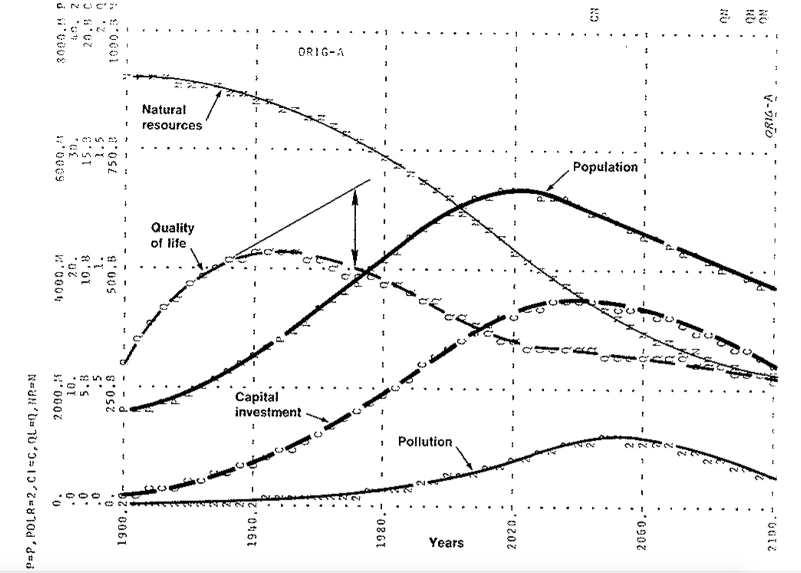

# Jay Forrester's World2 from 1971 Recreated in C++

World2 models the demographic, industrial, agricultural and natural resource sources and sinks (pollution) of the earth. The system dynamics model was documented in [Jay W. Forrester's](https://en.wikipedia.org/wiki/Jay_Wright_Forrester) book World Dynamics, published in 1971.

The model was developed further by [Donella](https://en.wikipedia.org/wiki/Donella_Meadows) and [Dennis](https://en.wikipedia.org/wiki/Dennis_Meadows) Meadows and others at MIT and formed the basis of the book [Limits to Growth](https://en.wikipedia.org/wiki/The_Limits_to_Growth), published in 1972.

The original World2 was written in the [DYNAMO](https://en.wikipedia.org/wiki/DYNAMO_(programming_language)) language and appears in Appendix B of the book World Dynamics.

This project recreates the World2 model in C++. The program prints an arbitrary number of graphs (7) that reproduce Figures 4-1 to 4-7 in Forrester's book.

I believe it to be an accurate recreation of the original because I closely followed the original DYNAMO code, and because, for the graphs recreated, the curves are point-for-point identical to those shown in Forrester's book.



Figure 4-1, as printed on page 70 of Forrester's World Dynamics. Caption: "Basic behavior of the world model, showing the mode in which industrialization and population are suppressed by falling natural resources."


The equivalent graph, as generated by [world2.cpp](src/world2.cpp).

---

I thought it was rather lovely to have the complete source code for the World2 model printed in a couple of pages of Appendix B in Forrester's book. This is a verbatim transcription of that appendix:

```text
        *         WORLD DYNAMICS W5
 1      L    P.K=P.J+(DT)(BR.JK-DR.JK)
 1.1    N    P=PI
 1.2    C    PI=1.65E9
 2      R    BR.KL=(P.K)(CLIP(BRN,BRN1,SWT1,TIME.K))(BRFM.K)(BRMM.K)(BRCM.K)(BR
 2.1    X    PM.K)
 2.2    C    BRN=.04
 2.3    C    BRN1=.04
 2.4    C    SWT1=1970
 3      A    BRMM.K=TABHL(BRMMT,MSL.K,0,5,1) 
 3.1    T    BRMMT=1.2/1/.85/.75/.7/.7
 4      A    MSL.K=ECIR.K/(ECIRN)
 4.1    C    ECIRN=1
 5      A    ECIR.K=(CIR.K)(1-CIAF.K)(NREM.K)/(1-CIAFN)
 6      A    NREM.K=TABLE(NREMT,NRFR.K,0,1,.25)
 6.1    T    NREMT=0/.15/.5/.85/1
 7      A    NRFR.K=NR.K/NRI
 8      L    NR.K=NR.J+(DT)(-NRUR.JK)
 8.1    N    NR=NRI
 8.2    C    NRI=900E9
 9      R    NRUR.KL=(P.K)(CLIP(NRUN,NRUN1,SWT2,TIME.K))*(NRMM.K)
 9.1    C    NRUN=1
 9.2    C    NRUN1=1
 9.3    C    SWT2=1970
        NOTE      EQUATION 42 CONNECTS HERE FROM EQ. 4 TO EQ.9
10      R    DR.KL=(P.K)(CLIP(DRN,DRN1,SWT3,TIME.K))(DRMM.K)(DRPM.K)(DRFM.K)(DR
        X    CM.K)
10.2    C    DRN=.028
10.3    C    DRN1=.028
10.4    C    SWT3=1970
11      A    DRMM.K=TABHL(DRMMT,MSL.K,0,5,.5)
11.1    T    DRMMT=3/1.8/1/.8/.7/.6/.53/.5/.5/.5/.5
12      A    DRPM.K=TABLE(DRPMT,POLR.K,0,60,10)
12.1    T    DRPMT=.92/1.3/2/3.2/4.8/6.8/9.2
13      A    DRFM.K=TABHL(DRFMT,FR.K,0,2,.25)
13.1    T    DRFMT=30/3/2/1.4/1/.7/.6/.5/.5
14      A    DRCM.K=TABLE(DRCMT,CR.K,0,5,1)
14.1    T    DRCMT=.9/1/1.2/1.5/1.9/3
15      A    CR.K=(P.K)/(LA*PDN)
15.1    C    LA=135E6
15.2    C    PDN=26.5
16      A    BRCM.K=TABLE(BRCMT,CR.K,0,5,1)
16.1    T    BRCMT=1.05/1/.9/.7/.6/.55
17      A    BRFM.K=TABHL(BRFMT,FR.K,0,4,1)
17.1    T    BRFMT=0/1/1.6/1.9/2
18      A    BRPM.K=TABLE(BRPMT,POLR.K,0,60,10)
18.1    T    BRPMT=1.02/.9/.7/.4/.25/.15/.1
19      A    FR.K=(FPCI.K)(FCM.K)(FPM.K)(CLIP(FC,FC1,SWT7,TIME.K))/FN
19.1    C    FC=1
19.2    C    FC1=1
19.3    C    FN=1
19.4    C    SWT7=1970
20      A    FCM.K=TABLE(FCMT,CR.K,0,5,1)
20.1    T    FCMT=2.4/1/.6/.4/.3/.2
21      A    FPCI.K=TABHL(FPCIT,CIRA.K,0,6,1)
21.1    T    FPCIT=.5/1/1.4/1.7/1.9/2.05/2.2
22      A    CIRA.K=(CIR.K)(CIAF.K)/CIAFN
22.1    C    CIAFN=.3
23      A    CIR.K=CI.K/P.K
24      L    CI.K=CI.J+(DT)(CIG.JK-CID.JK)
24.1    N    CI=CII
24.2    C    CII=.4E9
25      R    CIG.KL=(P.K)(CIM.K)(CLIP(CIGN,CIGN1,SWT4,TIME.K))
25.1    C    CIGN=.05
25.2    C    CIGN1=.05
25.3    C    SWT4=1970
26      A    CIM.K=TABHL(CIMT,MSL.K,0,5,1)
26.1    T    CIMT=.1/1/1.8/2.4/2.8/3
27      R    CID.KL=(CI.K)(CLIP(CIDN,CIDN1,SWT5,TIME.K))
27.1    C    CIDN=.025
27.2    C    CIDN1=.025
27.3    C    SWT5=1970
28      A    FPM.K=TABLE(FPMT,POLR.K,0,60,10)
28.1    T    FPMT=1.02/.9/.65/.35/.2/.1/.05
29      A    POLR.K=POL.K/POLS
29.1    C    POLS=3.6E9
30      L    POL.K=POL.J+(DT)(POLG.JK-POLA.JK)
30.1    N    POL=POLI
30.2    C    POLI=.2E9
31      R    POLG.KL=(P.K)(CLIP(POLN,POLN1,SWT6,TIME.K))(POLCM.K)
31.1    C    POLN=1
31.2    C    POLN1=1
31.3    C    SWT6=1970
32      A    POLCM.K=TABHL(POLCMT,CIR.K,0,5,1)
32.1    T    POLCMT=.05/1/3/5.4/7.4/8
33      R    POLA.KL=POL.K/POLAT.K
34      A    POLAT.K=TABLE(POLATT,POLR.K,0,60,10)
34.1    T    POLATT=.6/2.5/5/8/11.5/15.5/20
35      L    CIAF.K=CIAF.J+(DT/CIAFT)((CFIFR.J*CIQR.J)-CIAF.J)
35.1    N    CIAF=CIAFI
35.2    C    CIAFI=.2
35.3    C    CIAFT=15
36      A    CFIFR.K=TABHL(CFIFRT,FR.K,0,2,.5)
36.1    T    CFIFRT=1/.6/.3/.15/.1
37      A    QL.K=(QLS)(QLM.K)(QLC.K)(QLF.K)(QLP.K)
37.1    C    QLS=1
38      A    QLM.K=TABHL(QLMT,MSL.K,0,5,1)
38.1    T    QLMT=.2/1/1.7/2.3/2.7/2.9
39      A    QLC.K=TABLE(QLCT,CR.K,0,5,.5)
39.1    T    QLCT=2/1.3/1/.75/.55/.45/.38/.3/.25/.22/.2
40      A    QLF.K=TABHL(QLFT,FR.K,0,4,1)
40.1    T    QLFT=0/1/1.8/2.4/2.7
41      A    QLP.K=TABLE(QLPT,POLR.K,0,60,10)
41.1    T    QLPT=1.04/.85/.6/.3/.15/.05/.02
        NOTE      EQUATION 42 LOCATED BETWEEN EQ. 4 AND 9.
42      A    NRMM.K=TABHL(NRMMT,MSL.K,0,10,1)
42.1    T    NRMMT=0/1/1.8/2.4/2.9/3.3/3.6/3.8/3.9/3.95/4
        NOTE      INPUT FROM EQN. 38 AND 40 TO EQN. 35
43      A    CIQR.K=TABHL(CIQRT,QLM.K/QLF.K,0,2,.5)
43.1    T    CIQRT=.7/.8/1/1.5/2
        NOTE
        NOTE CONTROL CARDS
        NOTE
43.5    C    DT=.2
43.6    C    LENGTH=2100
43.7    N    TIME=1900
44      A    PRTPER.K=CLIP(PRTP1,PRTP2,PRSWT,TIME.K)
44.1    C    PRTP1=0
44.2    C    PRTP2=0
44.3    C    PRSWT=0
45      A    PLTPER.K=CLIP(PLTP1,PLTP2,PLSWT,TIME.K)
45.1    C    PLTP1=4
45.2    C    PLTP2=4
45.3    C    PLSWT=0
        PLOT P=P(0,8E9)/POLR=2(0,40)/CI=C(0,20E9)/QL=Q(0,2)/NR=N(0,1000E9)
        NOTE PLOT FR=F,MSL=M,QLC=4,QLP=5(0,2)/CIAF=A(.2,.6) 
        RUN  ORIG
```

This DYNAMO code is represented in [world2.cpp](src/world2.cpp) by this class:

```cpp
class world {

    // numbers in square brackets refer to the line numbers of
    // Forrester's original World2 DYNAMO code

public:
    struct constants {
        double brn      = .04;      //[2.2]     birth rate normal (fraction/year)
        double brn1     = .04;      //[2.3]     birth rate normal no. 1 (fraction/year)
        double ciafi    = .2;       //[35.2]    capital-investment-in-agriculture-fraction initial (dimensionless)
        double ciafn    = .3;       //[22.1]    capital-investment-in-agriculture fraction normal (dimensionless)
        double ciaft    = 15;       //[35.3]    capital-investment-in-agriculture-fraction adjustment time (years)
        double cidn     = .025;     //[27.1]    capital-investment discard normal (fraction/year)
        double cidn1    = .025;     //[27.2]    capital-investment discard normal no. 1 (fraction/year)
        double cign     = .05;      //[25.1]    capital-investment generation normal (capital units/person/year)
        double cign1    = .05;      //[25.2]    capital-investment generation normal no. 1 (capital units/person/year)
        double cii      = .4E9;     //[24.2]    capital-investment, initial (capital units)
        double drn      = .028;     //[10.2]    death rate normal (fraction/year)
        double drn1     = .028;     //[10.3]    death rate normal no. 1 (fraction/year)
        double ecirn    = 1;        //[4.1]     effective-capital-investment ratio normal (capital units/person)
        double fc       = 1;        //[19.1]    food coefficient (dimensionless)
        double fc1      = 1;        //[19.2]    food coefficient no. 1 (dimensionless)
        double fn       = 1;        //[19.3]    food normal (food units/person/year)
        double la       = 135E6;    //[15.1]    land area (square kilometers)
        double nri      = 900E9;    //[8.2]     natural resources, initial (natural resource units)
        double nrun     = 1;        //[9.1]     natural-resource usage normal (natural resource units/person/year)
        double nrun1    = 1;        //[9.2]     natural-resource usage normal no. 1 (natural resource units/person/year)
        double pdn      = 26.5;     //[15.2]    population density normal (people/square kilometer)
        double pi       = 1.65E9;   //[1.1]     population, initial (people)
        double poli     = .2E9;     //[30.2]    pollution, initial (pollution units)
        double poln     = 1;        //[31.1]    pollution normal (pollution units/person/year)
        double poln1    = 1;        //[31.2]    pollution normal no. 1 (pollution units/person/year)
        double pols     = 3.6E9;    //[29.1]    pollution standard (pollution units)
        double qls      = 1;        //[37.1]    quality-of-life standard (satisfaction units)
        double swt1     = 1970;     //[2.4]     switch time no. 1 for brn (years)
        double swt2     = 1970;     //[9.3]     switch time no. 2 for nrun (years)
        double swt3     = 1970;     //[10.4]    switch time no. 3 for drn (years)
        double swt4     = 1970;     //[25.3]    switch time no. 4 for cign (years)
        double swt5     = 1970;     //[27.3]    switch time no. 5 for cidn (years)
        double swt6     = 1970;     //[31.3]    switch time no. 6 for poln (years)
        double swt7     = 1970;     //[19.4]    switch time no. 7 for fc (years)

        double time     = 1900;     //[43.7]    calendar time (years)
        double dt       = 0.2;      //[43.5]    delta time (years)
        double endtime  = 2100;     // when time has this value the run should terminate
    };

    struct variables {
        // levels
        double ci   = 0;    // capital-investment (capital units)
        double ciaf = 0;    // capital-investment-in-agriculture fraction
        double nr   = 0;    // natural resources (natural resource units)
        double p    = 0;    // population
        double pol  = 0;    // pollution (pollution units)

        // rates
        double br   = 0;    // birth rate (people/year)
        double cid  = 0;    // capital-investment discard (capital units/year)
        double cig  = 0;    // capital-investment generation (capital units/year)
        double dr   = 0;    // death rate (people/year)
        double nrur = 0;    // natural-resource-usage rate (natural resource units/year)
        double pola = 0;    // pollution absorption (pollution units/year)
        double polg = 0;    // pollution generation (pollution units/year)

        // auxilaries
        double brcm = 0;    // birth-rate-from-crowding multiplier
        double brfm = 0;    // birth-rate-from-food multiplier
        double brmm = 0;    // birth-rate-from-material multiplier
        double brpm = 0;    // birth-rate-from-pollution multiplier
        double cfifr = 0;   // capital fraction indicated by food ratio
        double cim  = 0;    // capital-investment multiplier
        double ciqr = 0;    // capital-investment-from-quality ratio
        double cir  = 0;    // capital-investment ratio (capital units/person)
        double cira = 0;    // capital-investment ratio in agriculture (capital units/person)
        double cr   = 0;    // crowding ratio
        double drcm = 0;    // death-rate-from-crowding multiplier
        double drfm = 0;    // death-rate-from-food multiplier
        double drmm = 0;    // death-rate-from-material multiplier
        double drpm = 0;    // death-rate-from-pollution multiplier
        double ecir = 0;    // effective-capital-investment ratio (capital units/person)
        double fcm  = 0;    // food-from-crowding multiplier
        double fpci = 0;    // food potential from capital investment (food units/person/year)
        double fpm  = 0;    // food-from-pollution multiplier
        double fr   = 0;    // food ratio
        double msl  = 0;    // material standard of living
        double nrem = 0;    // natural-resource-extraction multiplier
        double nrfr = 0;    // natural-resource fraction remaining
        double nrmm = 0;    // natural-resource-from-material multiplier
        double polat = 0;   // pollution-absorption time (years)
        double polcm = 0;   // pollution-from-capital multiplier
        double polr = 0;    // pollution ratio
        double ql   = 0;    // quality of life
        double qlc  = 0;    // quality of life from crowding
        double qlf  = 0;    // quality of life from food
        double qlm  = 0;    // quality of life from material
        double qlp  = 0;    // quality of life from pollution

        double time = 0;    // calendar time (years)
    };


    world(const constants & c)
        : c(c), time_j_exists_(false)
    {
    }

    bool run_complete() const
    {
        return time_j_exists_ && j.time > c.endtime;
    }

    // return a reference to variables calculated for time .K
    const variables & tick()
    {
        variables k;

        if (time_j_exists_) {
            // calculate levels at time .K (note that .JK rates are shown here as j.xxx)
            k.p     = j.p + c.dt * (j.br - j.dr);       //[1]
            k.nr    = j.nr + c.dt * -j.nrur;            //[8]
            k.ci    = j.ci + c.dt * (j.cig - j.cid);    //[24]
            k.pol   = j.pol + c.dt * (j.polg - j.pola); //[30]
            k.ciaf  = j.ciaf + (c.dt / c.ciaft) * ((j.cfifr * j.ciqr) - j.ciaf); //[35]

            k.time  = j.time + c.dt;
        }
        else {
            // set levels to initial state
            k.p     = c.pi;
            k.nr    = c.nri;
            k.ci    = c.cii;
            k.pol   = c.poli;
            k.ciaf  = c.ciafi;

            k.time  = c.time;
        }

        // compute auxiliaries for time .K (reordered for dependencies)
        k.nrfr  = k.nr / c.nri; //[7]
        k.nrem  = dynamo::table({ 0, .15, .5, .85, 1 }, k.nrfr, 0, 1, .25); //[6, 6.1]
        k.cir   = k.ci / k.p; //[23]
        k.ecir  = k.cir * (1 - k.ciaf) * k.nrem / (1 - c.ciafn); //[5]
        k.msl   = k.ecir / c.ecirn; //[4]
        k.brmm  = dynamo::tabhl({ 1.2, 1, .85, .75, .7, .7 }, k.msl, 0, 5, 1); //[3, 3.1]
        k.drmm  = dynamo::tabhl({ 3, 1.8, 1, .8, .7, .6, .53, .5, .5, .5, .5 }, k.msl, 0, 5, .5); //[11, 11.1]
        k.cr    = k.p / (c.la * c.pdn); //[15]
        k.drcm  = dynamo::table({ .9, 1, 1.2, 1.5, 1.9, 3 }, k.cr, 0, 5, 1); //[14, 14.1]
        k.brcm  = dynamo::table({ 1.05, 1, .9, .7, .6, .55 }, k.cr, 0, 5, 1); //[16, 16.1]
        k.fcm   = dynamo::table({ 2.4, 1, .6, .4, .3, .2 }, k.cr, 0, 5, 1); //[20, 20.1]
        k.qlc   = dynamo::table({ 2, 1.3, 1, .75, .55, .45, .38, .3, .25, .22, .2 }, k.cr, 0, 5, .5); //[39, 39.1]
        k.cim   = dynamo::tabhl({ .1, 1, 1.8, 2.4, 2.8, 3 }, k.msl, 0, 5, 1); //[26, 26.1]
        k.polr  = k.pol / c.pols; //[29, 29.1]
        k.fpm   = dynamo::table({ 1.02, .9, .65, .35, .2, .1, .05 }, k.polr, 0, 60, 10); //[28, 28.1]
        k.drpm  = dynamo::table({ .92, 1.3, 2, 3.2, 4.8, 6.8, 9.2 }, k.polr, 0, 60, 10); //[12, 12.1]
        k.brpm  = dynamo::table({ 1.02, .9, .7, .4, .25, .15, .1 }, k.polr, 0, 60, 10); //[18, 18.1]
        k.polcm = dynamo::tabhl({ .05, 1, 3, 5.4, 7.4, 8 }, k.cir, 0, 5, 1); //[32, 32.1]
        k.polat = dynamo::table({ .6, 2.5, 5, 8, 11.5, 15.5, 20 }, k.polr, 0, 60, 10); //[34, 34.1]
        k.qlm   = dynamo::tabhl({ .2, 1, 1.7, 2.3, 2.7, 2.9 }, k.msl, 0, 5, 1); //[38, 38.1]
        k.qlp   = dynamo::table({ 1.04, .85, .6, .3, .15, .05, .02 }, k.polr, 0, 60, 10); //[41, 41.1]
        k.nrmm  = dynamo::tabhl({ 0, 1, 1.8, 2.4, 2.9, 3.3, 3.6, 3.8, 3.9, 3.95, 4 }, k.msl, 0, 10, 1); //[42, 42.1]
        k.cira  = k.cir * k.ciaf / c.ciafn; //[22]
        k.fpci  = dynamo::tabhl({ .5, 1, 1.4, 1.7, 1.9, 2.05, 2.2 }, k.cira, 0, 6, 1); //[21, 21.1]
        k.fr    = k.fpci * k.fcm * k.fpm * dynamo::clip(c.fc, c.fc1, c.swt7, k.time) / c.fn; //[19]
        k.drfm  = dynamo::tabhl({ 30, 3, 2, 1.4, 1, .7, .6, .5, .5 }, k.fr, 0, 2, .25); //[13, 13.1]
        k.brfm  = dynamo::tabhl({ 0, 1, 1.6, 1.9, 2 }, k.fr, 0, 4, 1); //[17, 17.1]
        k.cfifr = dynamo::tabhl({ 1, .6, .3, .15, .1 }, k.fr, 0, 2, .5); //[36, 36.1]
        k.qlf   = dynamo::tabhl({ 0, 1, 1.8, 2.4, 2.7 }, k.fr, 0, 4, 1); //[40, 40.1]
        k.ciqr  = dynamo::tabhl({ .7, .8, 1, 1.5, 2 }, k.qlm / k.qlf, 0, 2, .5); //[43, 43.1]
        k.ql    = c.qls * k.qlm * k.qlc * k.qlf * k.qlp; //[37]

        // calculate rates for period .KL (write direct to .JK as no references to .JK are made)
        k.br    = k.p * dynamo::clip(c.brn, c.brn1, c.swt1, k.time) * k.brfm * k.brmm * k.brcm * k.brpm; //[2, 2.1]
        k.nrur  = k.p * dynamo::clip(c.nrun, c.nrun1, c.swt2, k.time) * k.nrmm; //[9]
        k.dr    = k.p * dynamo::clip(c.drn, c.drn1, c.swt3, k.time) * k.drmm * k.drpm * k.drfm * k.drcm; //[10, 10.1]
        k.cig   = k.p * k.cim * dynamo::clip(c.cign, c.cign1, c.swt4, k.time); //[25]
        k.cid   = k.ci * dynamo::clip(c.cidn, c.cidn1, c.swt5, k.time); //[27]
        k.polg  = k.p * dynamo::clip(c.poln, c.poln1, c.swt6, k.time) * k.polcm; //[31]
        k.pola  = k.pol / k.polat; //[33]

        // shift .K to .J for next call to tick()
        j = k;
        time_j_exists_ = true;

        return j; // which on this tick is .K
    }

private:
    constants c;
    variables j;
    bool time_j_exists_ = false;
};

```

Build with MS Visual Studio 2019 Community command line ```cl /EHsc /W4 world2.cpp```

---


Credit: Screen grab from [ABC video](https://www.youtube.com/watch?v=cCxPOqwCr1I)

The above screen grab is from a lovely video from 1973 featuring the World1 program. "This electronic display emanating from Australia's largest computer is a picture of the condition past, present and future of planet earth," says the reporter. He goes on to say the program is called World1. The scientist featured is not named.

There is an interesting article about recreating World2 in R [here](https://towardsdatascience.com/world2-model-from-dynamo-to-r-2e44fdbd0975).

---

Are there limits to growth on a finite planet?

We are living through the [sixth mass extinction](https://www.theguardian.com/environment/2017/jul/10/earths-sixth-mass-extinction-event-already-underway-scientists-warn) of life on earth.

The rate of extinction of species is now [1,000 times the norm](https://en.wikipedia.org/wiki/Holocene_extinction).

One in every eight species on earth [face extinction within decades](https://www.nature.com/articles/d41586-019-01448-4).

At our current rate of CO2 emissions, we have about seven years before we exceed the [carbon budget](https://www.carbonbrief.org/analysis-why-the-ipcc-1-5c-report-expanded-the-carbon-budget) that would, if we kept to it, give us a two thirds chance of keeping global temperature rise to 1.5°C.

We are a couple of decades away from catastrophic and irreversible [climate tipping points](https://e360.yale.edu/features/as-climate-changes-worsens-a-cascade-of-tipping-points-looms).

Meanwhile, the "world’s biggest 60 banks have provided [$3.8 trillion](https://www.theguardian.com/environment/2021/mar/24/big-banks-trillion-dollar-finance-for-fossil-fuels-shocking-says-report) of financing for fossil fuel companies since the Paris climate deal in 2015."


Credit: [NASA](https://climate.nasa.gov/evidence/)

You can't fool all of the people all of the time. Eventually, the truth will be so big and so deep and so tall that our stone age brains will finally - finally - acknowledge it, and the completely avoidable [ghastly future](https://www.frontiersin.org/articles/10.3389/fcosc.2020.615419/full) will be with us.

What will our world look like at that point? How much death and ongoing human misery will the climate and ecological crisis have caused? Will we have to learn that there is no vaccine for irreversible climate change?

On the bright side, my “optimism bias” means I’m pretty sure the human race will adapt and survive. They may have time to ponder that you don’t know what you’ve got ‘til it’s gone. Shoo-bop-bop-bop-bop.

If you are so fortunate as to live in a democracy, please vote for a future.

Anthony Hay, March 2021.


